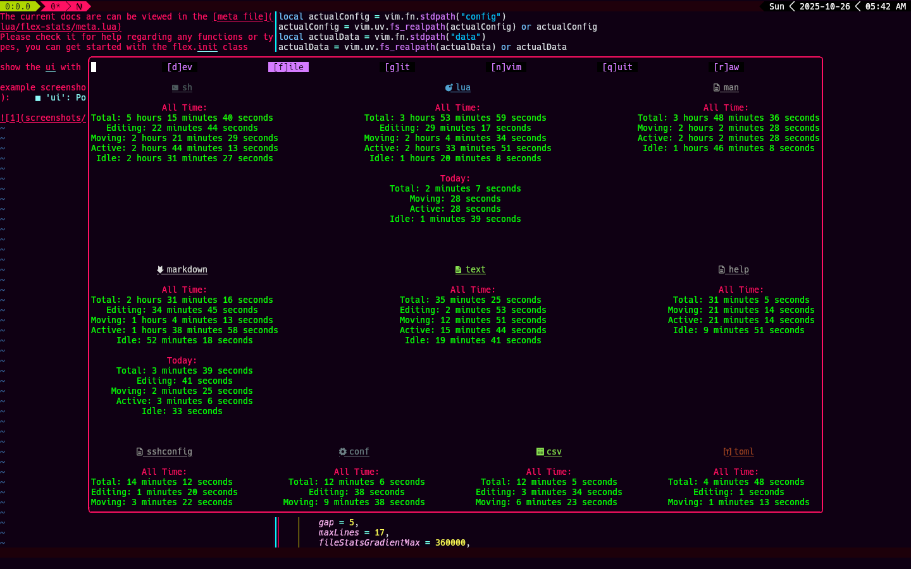

The current docs are can be viewed in the [meta file](lua/flex-stats/meta.lua)
Please check it for help regarding any functions or types, you can get started with the flex.init class

show the ui with `:Flex`

example screenshot (ui subject to change in the future):

Congrats, you made it to the bottom

if you can afford to pay my wifi bills, you can support me in patreon: https://www.patreon.com/IngenarelNeoJesus

i don't like putting this in my projects, but until my dropout ass finds a way to get a job/proper funding, i have no choice but to accept donations, which i personally don't want to trust me
